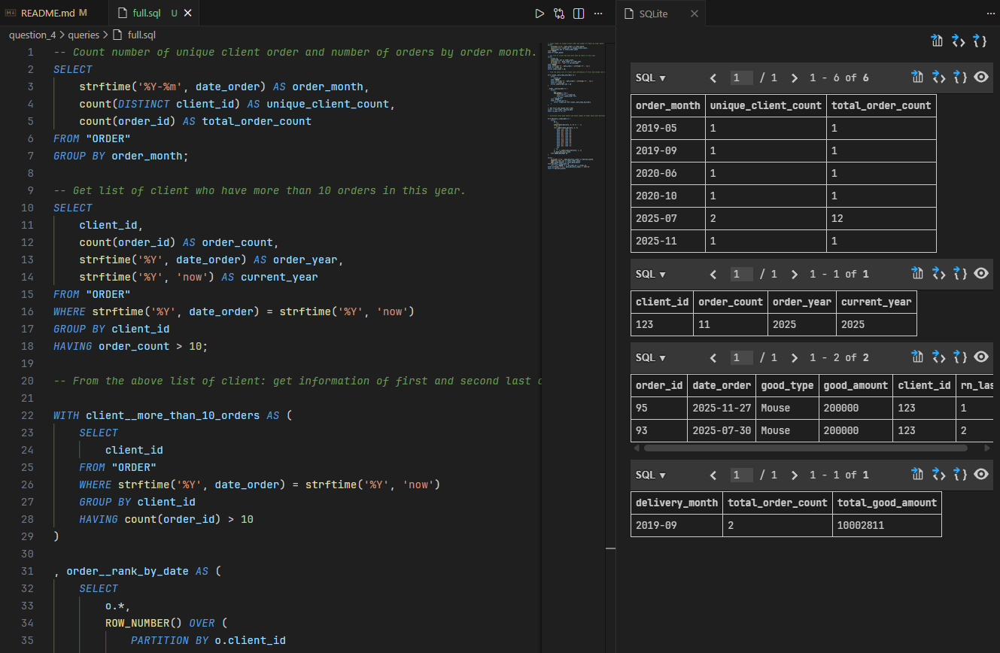
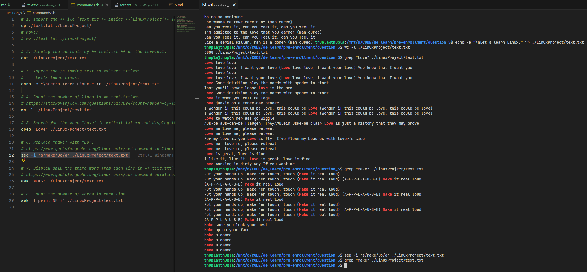

# pre-enrollment

## Question 1

[=&gt; Question 1 solution](question_1/)

## Question 2

[=&gt; Question 2 solution](question_2/)

## Question 3

[=&gt; Question 3 solution](question_3/)

## Question 4

[=&gt; Question 4 solution](question_4/)

Requirement 4.5: [Answer](question_4/5.md)

## Question 5

[=&gt; Question 5 solution](question_5/)

