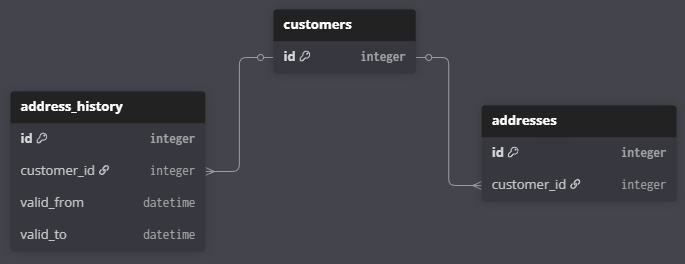
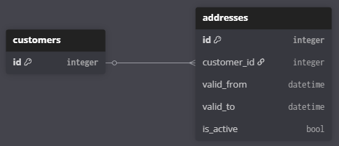

**Question 2**

**How would you structure a database schema to store address information for customers,
considering that the addresses of some customers may change over time? Give pros and
cons for each option?**

---

### Requirements

Functional requirements:

* Can customers has multiple concurrent address at the same time?
* Do we need to maintain address history?
* Do we need to query a customer's address at a specific point in time?

Non-functional:

* Who are main users? Their query patterns?
* Address update frequency?

### Options

| Option                           | Pros                                                                                                                                                              | Cons                                                                                                                                                             | When to choose                                                                                                               | Keywords   |
| -------------------------------- | ----------------------------------------------------------------------------------------------------------------------------------------------------------------- | ---------------------------------------------------------------------------------------------------------------------------------------------------------------- | ---------------------------------------------------------------------------------------------------------------------------- | ---------- |
| Single address in customer table | - Simplest                                                                                                                                                        | - No history tracking<br />- Not scalable                                                                                                                        | - Rapid prototye                                                                                                             |            |
| Json address in customer table   | - Flexible<br />- multiple address                                                                                                                                | - Hard to query<br />- Slow index<br />- No schema validation                                                                                                    | - Schema flexibility is critical<br />- Low query complexity on address fields                                               |            |
| Normalized current address table | - Support multiple addresses<br />- Simple<br />- Fast query<br />- Less storage requirements                                                                     | - No history tracking                                                                                                                                            | - Simple app<br />- No history requirements                                                                                  | normalize  |
| Separate address history         | - History tracking<br />- Fast read current table<br />- Clear separation transactional vs archival data<br />(lead to different storage, indexing,.. strategy) | - High storage cost<br />- Write complexity: write 2 tables<br />- Data duplication (address info across tables)<br />- Must query both tables for complete data | - Need to query historical data<br />- Read current address performance is critical<br />- High current address query volume | SCD Type 4 |
| Historical address table         | - History tracking<br />- Easy support point-in-time time query                                                                                                   | - High storage cost<br />- More complex queries<br />- Write complexity: Require closing address logic                                                         | - Need to query historical data<br />- Priotize measuring change affection over time                                         | SCD Type 2 |

#### Address in customer table

```plaintext
customers (id, address)
```

#### Json address column in customer

```plaintext
customers (id, addresses JSONB)
```

#### Normalized current address table

```plaintext
customers (id,...)
addresses (id, customer_id, updated_at, ...)
```

#### Separated address history table



```dbmlt
Table customers {
  id integer [pk]
}
Table addresses {
  id integer [pk]
  customer_id integer 
}
Table address_history {
  id integer [pk]
  customer_id integer
  valid_from datetime
  valid_to datetime
}
Ref: addresses.customer_id > customers.id
Ref: address_history.customer_id > customers.id

```

#### Historical address table



```dbml
Table customers {
  id integer [pk]
}

Table addresses {
  id integer [pk]
  customer_id integer 
  valid_from datetime
  valid_to datetime
  is_active bool
}

Ref: addresses.customer_id > customers.id

```
